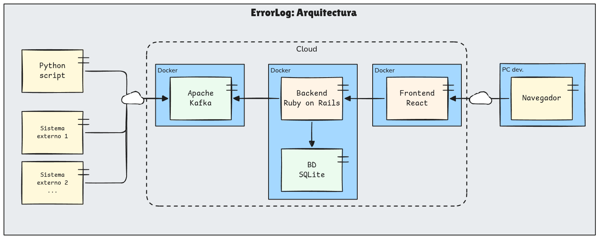

# Arquitectura

## Componentes e infraestructura

El sistema consiste en tres módulos principales, más algunos módulos auxiliares:

1. Productores
2. Instancia de Kafka
3. Sistema log de errores

Los **productores** son los programas o aplicaciones que tendrán errores y los comunicarán al sistema central de este proyecto.

Con motivo de demostración, en este repositorio se incluirán programas Python que generan errores a propósito: uno que intenta dividir por cero, otro que exceda el largo de un arreglo, etc. En el uso real, serán sistemas externos.

La **instancia de Kafka** actúa como buffer de eventos: recibe los errores de los productores, y provee una interfaz con la que el sistema central consultará los errores existentes.

El **sistema log de errores** es el sistema central de este proyecto. Debe leer los errores existentes en la base de Kafka y proveer una interfaz web para que los desarrolladores de los productores puedan gestionar los errores.
El mismo consistirá en una aplicación web SPA: backend REST Ruby + frontend React.

Se utilizará Docker para containerizar los módulos, salvo para los productores, ya que los incluídos en el repositorio son a modo de ejemplo.

En definitiva, una imagen Docker distinta para cada uno de los siguientes:

- Servicio de Kafka
- Backend Ruby + BD SQLite
- Frontend React

## Sistema de Archivos

Directorios separados por responsabilidad.

~~~
docker-compose.yaml # Levantar imágenes de Kafka, base de datos, Ruby y React.

docs/ # Documentación del proyecto.

producers/ # Scripts Python que comandarán errores a Kafka, por ejemplo:
    producer_division_by_cero.py
    producer_index_error.py
    requirements.txt # dependencias de esos scripts.

backend/ # Aplicación Ruby on Rails.
    app/
    bin/
    Gemfile    # Dependencias del proyecto Ruby
    Dockerfile # Define cómo levantar la aplicación como imagen Docker

frontend/ # Aplicación React.
    src/
    package.json
    Dockerfile
~~~

## Kafka: Contrato de datos (tópico `error-logs`)

Los productores publican un único tipo de mensaje en el tópico `error-logs`. El
contrato se define en
[`docs/error_log_event.schema.json`](error_log_event.schema.json) (JSON Schema
draft-07).

Ejemplo de payload válido:

~~~json
{
  "timestamp": "2026-09-17T14:30:00Z",
  "service_name": "producer_division_by_cero",
  "error_type": "ZeroDivisionError",
  "message": "division by zero",
  "stack_trace": "Traceback (most recent call last):\n  ...",
  "severity": "error",
  "metadata": {
    "environment": "development",
    "user_id": 42
  }
}
~~~

Consideraciones:

- La **message key** de Kafka es el `service_name`: todos los errores de un mismo
  servicio van a la misma partición, conservando el orden de ocurrencia.
- El objeto de primer nivel es estricto (`additionalProperties: false`): cualquier
  dato extra debe ir dentro de `metadata`, el contenedor oficial de contexto
  (`request_id`, `user_id`, `environment`, etc.).
- `stack_trace` es opcional: hay errores que se reportan sin traza de pila.